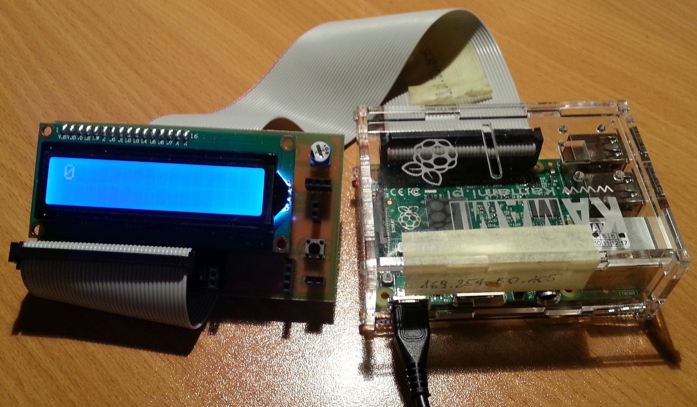

# RPi Vibration Measurement

This is the project of the device based on [Raspberry Pi 2 B](https://www.raspberrypi.org/) and [RTEMS](https://www.rtems.org/) intended for universal measurements of vibrations of machines and other physical properties.

## Setting up an RTEMS development environment
Thanks to the [Alan's Tech Notes](http://alanstechnotes.blogspot.com/2013/03/rtems-on-raspberry-pi.html) I managed to set up development environment properly on Ubuntu 16.04 64-bit.  
Steps:
```Shell
mkdir ~/development/rtems/compiler
cd ~/development/rtems

git clone git://git.rtems.org/rtems-source-builder.git
cd rtems-source-builder
source-builder/sb-check
```
You should see something like:
```
RTEMS Source Builder - Check, 4.12 (1c68dbb29392)
Environment is ok
```
Next:
```Shell
cd rtems
../source-builder/sb-set-builder --log=build-log.txt --prefix=$HOME/development/rtems/compiler/4.12 4.12/rtems-arm
```
It will take a while.  
After successful build, edit _.profile_ in your _$HOME_ directory and add:
```Shell
PATH=$HOME/development/rtems/compiler/4.12/bin:$PATH
```
Logout and login back. After entering:
```Shell
arm-rtems4.12-gcc -v
```
You should see compiler version.  
Now follow next steps:
```Shell
cd ~/development/rtems
git clone git://git.rtems.org/rtems.git rtems-git
cd rtems-git
./bootstrap

cd ~/development/rtems
mkdir build-rtems-rpi
cd build-rtems-rpi
../rtems-git/configure --target=arm-rtems4.12 --enable-rtemsbsp=raspberrypi2 --enable-tests=samples --enable-networking --enable-posix --prefix=$HOME/development/rtems/bsps/4.12
make install
```
Now environment should be ready.

## Simple example

First, I wanted to test some basic interfaces and OS API functions.  
I connected my custom board with [HD44780 LCD](https://en.wikipedia.org/wiki/Hitachi_HD44780_LCD_controller) display and push button to Raspberry Pi by GPIO expansion in the following configuration:
* Button - GPIO 26
* HD44780 RS - GPIO 14
* HD44780 E - GPIO 15
* HD44780 D4 - GPIO 18
* HD44780 D5 - GPIO 23
* HD44780 D6 - GPIO 24
* HD44780 D7 - GPIO 25

<div align="center"></div>

Next, I created basic application which displayed 0 or 1 on display whether the button was pushed or not. It utilized RTEMS API, including threads and mutexes.  
The example application is placed in [src](src) directory. To build run:
```Shell
make
```
To run the example on Raspberry Pi go into the resulting folder with binaries and get _.ralf_ file. Rename it to _kernel.img_ and place in empty SD card. Files [bootcode.bin](https://github.com/raspberrypi/firmware/blob/master/boot/bootcode.bin) and [start.elf](https://github.com/raspberrypi/firmware/blob/master/boot/start.elf) have to be placed on SD card as well (some versions of these files didn't work for me).  
After placing SD card in Raspberry Pi and powering it up, 0 should be visible on the display.

Also I managed to successfully run UART console together with I²C and SPI interfaces (not included in above example).

## To Be Continued

<a rel="license" href="http://creativecommons.org/licenses/by-sa/4.0/"></a><br /><span xmlns:dct="http://purl.org/dc/terms/" property="dct:title">RPi Vibration Measurement</span> by <span xmlns:cc="http://creativecommons.org/ns#" property="cc:attributionName">Karol Leszczyński</span> is licensed under a <a rel="license" href="http://creativecommons.org/licenses/by-sa/4.0/">Creative Commons Attribution-ShareAlike 4.0 International License</a>.
